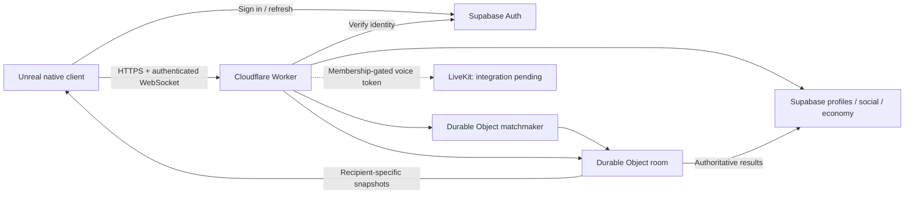

# Architecture

The client owns local rack arrangement, gestures, UI and animation. Private reordering does not submit a legal game action. The room owns gameplay state and rejects invalid ownership, stale versions and out-of-turn actions. Repeated snapshots must not cancel a local drag or duplicate tile actors.

Queue cancellation is scoped to a queue attempt; late callbacks cannot cancel a newer attempt. Auth/session changes clear request identities and reject stale responses. A successful local server test is not evidence of a production four-Unreal-client match.

Supabase is the persistent boundary for profiles and appropriate social, progression, inventory, economy and moderation records. Native screens for all of these are not complete. Purchases/rewards must stay server-authoritative; owner entitlements must be UUID/admin-based, never display-name based.
