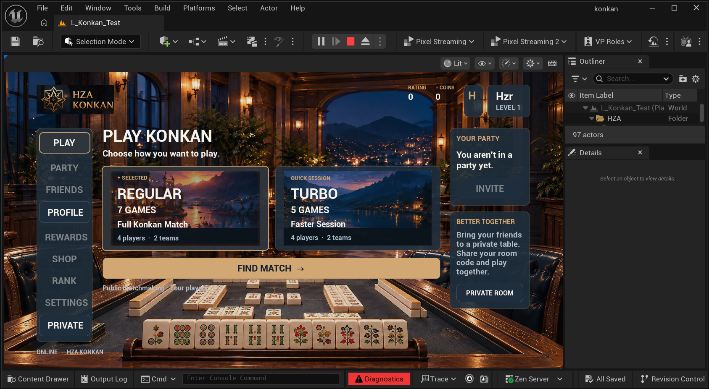
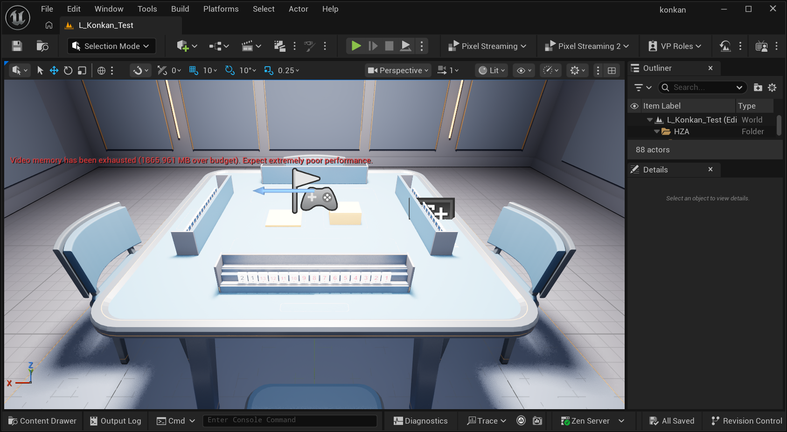
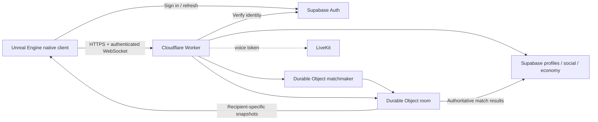

<p align="center">
  <h1 align="center">HZA KONKAN</h1>
  <p align="center"><strong>Native multiplayer Konkan in Unreal Engine — authoritative backend, private-hand security, Kurdish-first product direction.</strong></p>
</p>

<p align="center">
  
  
  
  
  
</p>

> **Engineering showcase.** This repository is a sanitized demo export from HZA KONKAN checkpoint `8c0b4f3` (2026-10-08). It contains real selected source, reproducible tests, architecture notes, and actual Unreal screenshots. It is intentionally **not** the full private production repository or a packaged game.

> **Important scope note:** This repository contains a simplified browser-based rules playground and selected engineering source code. The browser playground exists only to demonstrate the MIT-licensed game rules engine. It is not the complete HZA KONKAN game, does not represent the final user interface or graphics, and is not a production multiplayer release. The actual HZA KONKAN project is being developed separately with Unreal Engine, C++, Supabase, Cloudflare Workers, and other technologies.

## What is HZA KONKAN?

HZA KONKAN is a native multiplayer tile game being built with Unreal Engine, Supabase, and Cloudflare Durable Objects. The project focuses on responsive rack interaction, authoritative multiplayer, recipient-specific/private game state, secure account flows, and Kurdish-first localization plans across Sorani and Badini, with Arabic and English support planned alongside them.

The private production project includes the full Unreal map/content, native plugin, backend infrastructure, Blender workflow, cloud configuration, and ongoing gameplay systems. This public demo is designed to show the engineering without exposing production credentials or private infrastructure.

### Cultural context

Konkan is a tile game with deep roots in Kurdish social life. HZA KONKAN is an owner-directed attempt to build a modern Kurdish-first digital experience, with Sorani and Badini localization planned alongside Arabic and English. The public rules package is a small, practical way for other developers to study deterministic multiplayer game logic while the culturally specific product and production systems remain protected.

### What is open source here?

The reusable rules package in [`packages/konkan-rules/`](packages/konkan-rules/) is released under MIT. It contains deterministic tile/rule logic, bot decisions over redacted views, modes, rack ordering, tests, and rules documentation. The rest of this repository is a reserved showcase under [`LICENSE-NOTICE.md`](LICENSE-NOTICE.md), including the Unreal source, backend integrations, screenshots, branding, Blender workflow, and deployment details.

## Two different things are shown here

### Technical browser demonstration

The local browser playground is a deliberately small technical demonstration built on `packages/konkan-rules/`. It lets a developer inspect legal actions, draw and discard tiles, validate selected melds, see bot suggestions, and observe redacted views. Its controls, layout, styling, and feature set are test-oriented and should not be read as a preview of the final game.

Run it locally with the instructions in [Try the rules playground locally](#try-the-rules-playground-locally). It is not deployed by this repository.

### Actual Unreal development screenshots

The screenshots below are clearly labeled development evidence from the separate native project. They show selected integration work and historical art passes, not a finished public release.

#### Native Unreal lobby



The native lobby foundation includes Regular/Turbo selection, real queue search/cancel, profile navigation, private-room navigation, native authentication, and Remember Me restoration. The pictured Moonlit background is a historical development art pass that the project owner has since chosen to retire; it is included here as evidence of real UI integration, not final art direction.

#### Real Unreal gameplay development viewport



This is an actual Unreal development scene, including real tile/rack actors and an intentionally visible VRAM warning. The environment, tile proportions, lighting, and final cosmetics are still under active replacement rather than being presented as finished art.

## Verified at this checkpoint

| Area | Verified evidence |
| --- | --- |
| Native tile interaction | Mouse/touch selection, drag/reorder, cross-row insertion, cancellation, invalid-drop recovery |
| Table presentation | Snapshot-driven HUD/presentation and privacy regression coverage |
| Authentication | Native Supabase auth, case-insensitive profile onboarding, secure Windows session restoration |
| Lobby | Real account restore, mode selection, queue search/cancel, profile and private-room navigation |
| Backend logic | Authoritative rules and recipient-specific state tests |
| Demo test suite | **22 tests passing locally** with `npm test` |

These are checked behaviors in the exported code. They do not mean the full Unreal game, production services, or a four-client multiplayer release is complete.

See [TESTING.md](TESTING.md) for what each test proves — and what it does **not** prove yet.

## Architecture



The Unreal client owns local presentation, input, animation, and private rack arrangement. The server owns legal gameplay state. A client sends intent; the authoritative room validates ownership, turn, phase, and action legality before state changes are accepted.

Opponent private hand values are not meant to be shipped to other clients and merely hidden visually; the protocol is designed around recipient-specific snapshots.

More detail: [ARCHITECTURE.md](ARCHITECTURE.md) and [SECURITY.md](SECURITY.md).

## Tech stack

- **Unreal Engine 5.8 / C++ / UMG** — native client, input, HUD, menus, presentation
- **Supabase Auth + PostgreSQL** — identity, profiles, persistent account systems
- **Cloudflare Workers + Durable Objects** — matchmaking and authoritative live rooms
- **TypeScript / Node.js** — shared rules, backend logic, automated tests
- **Blender 5.2 LTS** — 3D asset production workflow
- **LiveKit** — intended voice layer; full native verification is still pending

See [TECH-STACK.md](TECH-STACK.md).

## Run the demo tests

Requires **Node.js 22.13+**.

```bash
npm test
```

No package installation, cloud credentials, or Unreal installation is required for the default suite.

Current exported result:

```text
22 tests
22 passed
0 failed
```

The suite covers rule validity, legal-action rejection, hidden-state views, bot legality using redacted seat views, WebSocket ownership/replacement behavior, malformed events, HTTPS enforcement, and cumulative match-result logic.

An optional local Worker integration suite is documented in [TESTING.md](TESTING.md).

## Try the rules playground locally

The MIT package includes a local browser demonstration that uses the real rules engine, validates selected melds, shows rejected actions, and advances bot turns using redacted views. It is not deployed automatically:

```bash
cd packages/konkan-rules
npm install
npm run demo
```

Open <http://localhost:4173>. See [packages/konkan-rules/examples/README.md](packages/konkan-rules/examples/README.md).

## Repository map

```text
.
├── packages/konkan-rules/ MIT-licensed reusable rules package
├── selected-source/      Sanitized real source selections
│   ├── backend/
│   ├── blender/
│   └── lib/
├── tests/                Reproducible demo tests
├── screenshots/          Actual Unreal development screenshots
├── docs/                 Protocol, manifests, test output, scan output
├── tools/                Demo verification / secret scan
├── ARCHITECTURE.md
├── AI-DEVELOPMENT.md
├── PROJECT-ROADMAP.md
├── SECURITY.md
├── TESTING.md
└── TECH-STACK.md
```

## AI-assisted engineering workflow

HZA KONKAN is owner-directed and uses ChatGPT/Codex/Astra as engineering assistance for C++, Unreal integration, backend work, debugging, tests, Blender workflows, UI iteration, and documentation.

The project workflow is not “generate and accept.” The working loop is:

```text
inspect current checkpoint
→ make a scoped change
→ compile/link
→ run focused tests
→ install into the real Unreal project
→ inspect actual runtime behavior
→ fix failures
→ commit a stable checkpoint
```

See [AI-DEVELOPMENT.md](AI-DEVELOPMENT.md).

## Current roadmap

### Completed / verified foundation

- Native mouse + touch rack interaction
- Snapshot-driven table presentation and privacy tests
- Supabase authentication and profile onboarding
- Secure Windows Remember Me restoration
- Native lobby foundation
- Real public queue search/cancel validation

### In progress

- Final gameplay room/table/rack/tile art direction
- Larger, tighter, more readable local hand presentation
- Private-room and multiplayer completion
- Cosmetics/economy integration
- Daily rewards and social systems

The in-progress and planned items above are product roadmap entries, not claims about the browser demonstration. The browser package remains intentionally focused on reusable rules and validation.

### Planned release gates

- Four separately authenticated Unreal clients completing a full round
- Robust reconnect without duplicate seat/player/reward state
- Kurdish Sorani, Kurdish Badini, Arabic, and English localization
- Physical Android validation and secure Android session persistence
- Voice, performance/VRAM pass, Windows/Android packaging, iOS preparation

See [PROJECT-ROADMAP.md](PROJECT-ROADMAP.md).

## Contributing

Contributions are currently scoped to the MIT-licensed rules package and documentation. See [CONTRIBUTING.md](CONTRIBUTING.md), the [Code of Conduct](CODE_OF_CONDUCT.md), and the issue templates before opening a change.

## Security and privacy

This demo intentionally excludes production credentials, browser/session data, private account identifiers, deployment secrets, player records, raw build directories, and service-role credentials. Public-demo source uses placeholders and synthetic test fixtures where needed.

Before publishing changes, run:

```bash
python tools/verify_demo.py
```

The included export scan currently reports **PASS**. See [SECURITY.md](SECURITY.md) and `docs/SECRET-SCAN.json`.

## What this repository is — and is not

**It is:**

- a real engineering showcase
- selected production-derived source
- runnable local tests
- architecture/security documentation
- actual development screenshots

**It is not:**

- the full private game repository
- a downloadable release build
- a complete Unreal project
- proof that every planned feature is finished

That distinction is intentional: the goal is to demonstrate real work without publishing private infrastructure or overstating project readiness.

## Rights / licensing

No broad open-source license has been granted for this showcase. Project-specific source, branding, screenshots, and assets remain subject to the rights described in [LICENSE-NOTICE.md](LICENSE-NOTICE.md). Third-party technologies retain their own licenses and terms.
